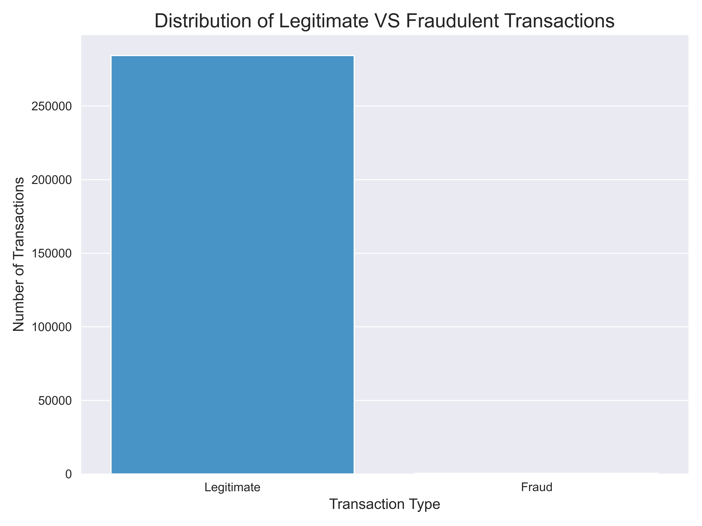

# Credit-Card-Fraud-Analysis
## 📊 Visualizations & Insights  

This project performs an exploratory data analysis (EDA) on the Credit Card Fraud Detection dataset using Python, Pandas, Matplotlib, and Seaborn. 
The goal is to uncover patterns and insights about fraudulent transactions through a series of clear and informative visualizations.

# Project Overview

Credit card fraud is a major concern for banks and financial institutions. Every day, millions of transactions occur, and a tiny fraction of them are fraudulent. The challenge is to identify these bad transactions without accidentally blocking legitimate ones. This project takes a first step in that direction by using data visualization to "see" what fraud looks like. We explore the data to answer simple but crucial questions: How often does fraud occur compared to normal transactions? Do fraudsters steal large or small amounts of money? Does fraud happen more at certain times of the day? Understanding these patterns is the foundation for building effective fraud detection systems.

# Dataset

The dataset used is the "Credit Card Fraud Detection" dataset from Kaggle, sourced from a collaboration between Worldline and the Machine Learning Group of ULB (Université Libre de Bruxelles).
- **Source:** https://www.kaggle.com/datasets/mlg-ulb/creditcardfraud
- **Content:** The data contains transactions made by European cardholders in September 2013. For privacy, the original features have been transformed via Principal Component Analysis (PCA) into 28 numerical columns (V1 to V28). The only features that have not been transformed are Time, Amount, and Class.
- **Class:** This is the target variable, where 1 indicates a fraudulent transaction and 0 indicates a legitimate one.

### 1️⃣ Visualization 1: The Imbalance Problem 

This bar chart shows the massive difference between the number of normal and fraudulent transactions. The tall blue bar represents over 284,000 legitimate transactions, while the tiny red bar next to it represents only 492 fraudulent ones. This visual makes it clear that fraud is a "needle in a haystack" problem.

# Python 

**A seaborn.countplot was used to visualize the frequency of each category in the Class column**

